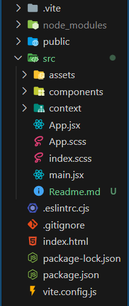

**PROYECTO MI E-COMMERCE** 🖥️

*Descripción*📋

El objetivo de este proyecto es crear un e-commerce ficticio utilizando Node.js, Express, React y React Context. Se implementará una API REST para manejar las operaciones relacionadas con los productos, usuarios y pedidos de la tienda online.

* * *

**Tabla de contenidos**

- Objetivos
- Diagrama y Arquitectura
- Tecnología
- Autor

* * *

**Objetivos** 🎯

El proyecto tiene como finalidad lograr los siguientes objetivos:

1. Implementar el registro de usuarios y la encriptación de contraseñas utilizando Bcrypt.

2. Habilitar el inicio de sesión utilizando tokens JSON Web (JWT) y el uso de middleware para autenticar las solicitudes.

3. Crear una variedad de puntos finales CRUD para los recursos de productos, usuarios y pedidos.

4. Establecer relaciones entre las diferentes entidades, como usuarios y pedidos, utilizando referencias y subdocumentos en MongoDB.

5. Utilizar seeders para crear datos de muestra en la base de datos.

* * *

**Diagrama y Arquitectura**

El proyecto sigue la siguiente arquitectura de carpetas y archivos:

Esta es la estructura de los componentes:

* * *

**Construido con** 🛠️

- React
- React Context
- Node.js
- Express
- MySQL
- Sequelize
- Visual Studio Code

* * *

**Autor** ✒️

- Valentí Barat
